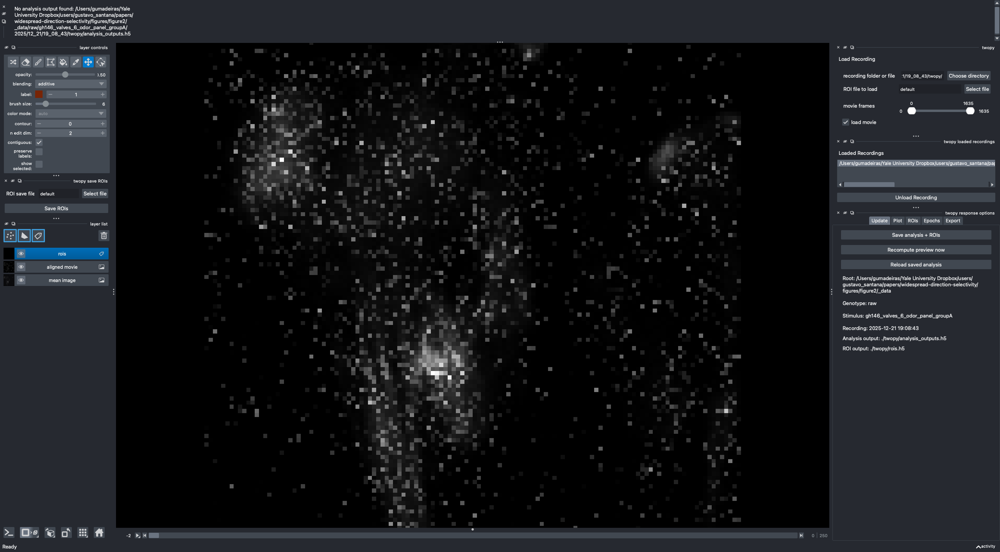
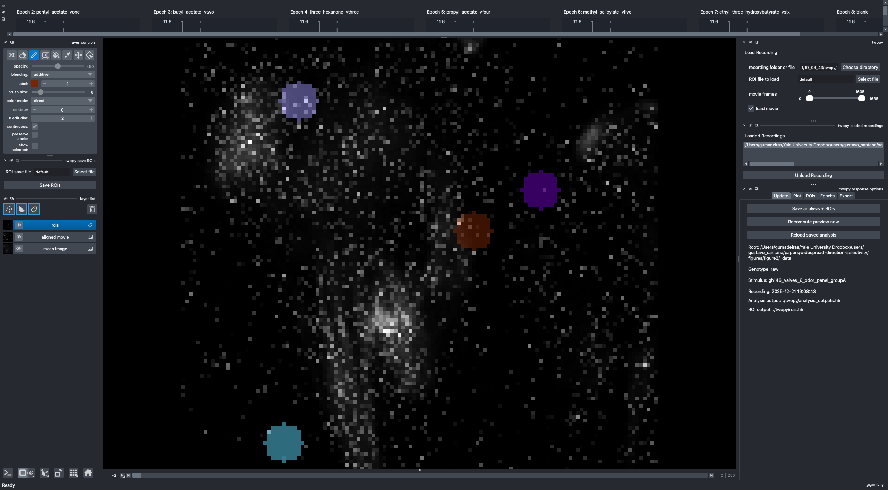
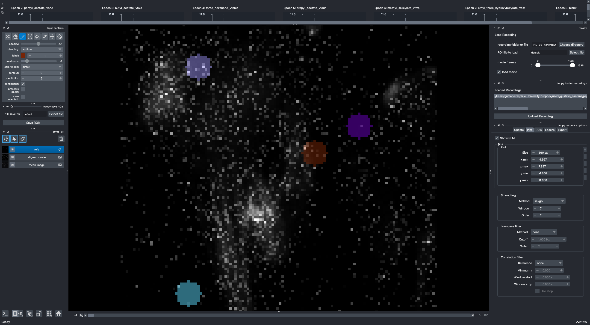
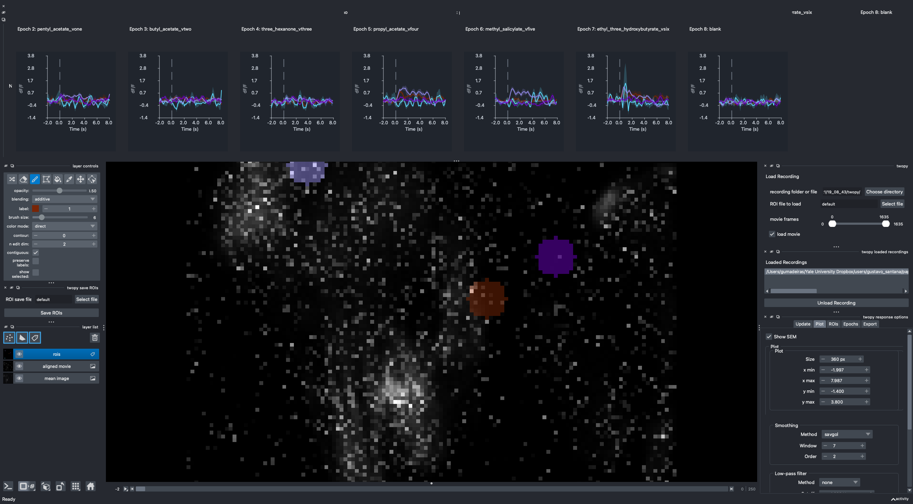
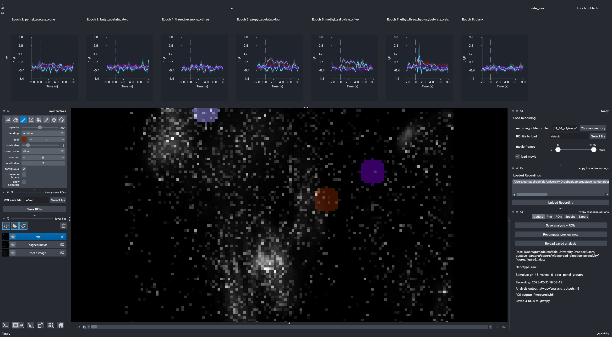
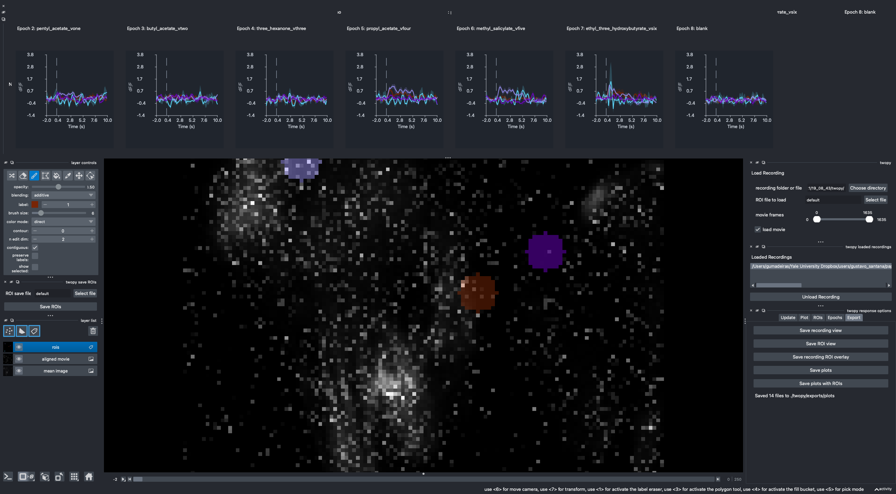

# twopy Tutorial

This guide walks through a basic twopy session: install the app, launch it, open a recording, draw ROIs, turn on Savitzky-Golay smoothing, save the analysis and ROI file, then export response plots.

## Install twopy

Create a Python 3.13 environment and install twopy:

```sh
micromamba create -n twopy -c conda-forge python=3.13 pip -y
micromamba run -n twopy python -m pip install twopy
```

Check that the package imports:

```sh
micromamba run -n twopy python -c 'import twopy; print(twopy.__name__)'
```

For development from this repository, use the repo environment instead:

```sh
micromamba env create -f environment.yml
micromamba run -n twopy python -m pip install -e .
```

## Launch The App

Start twopy without activating the environment:

```sh
micromamba run -n twopy twopy
```

Or open a recording directly:

```sh
micromamba run -n twopy twopy /path/to/recording_data.h5
```

You can pass a source recording folder, a converted folder, or a direct `recording_data.h5` path. If you start without a path, use the `twopy` panel on the right to choose a recording.



## Open A Recording

In the right-side `twopy` panel:

1. Click `Search database` to find a recording from `config.yml`, or click `Load manually` to choose a source recording folder, converted folder, or `recording_data.h5`.
2. Use `Reload saved analysis` when you want the current recording's saved `analysis_outputs.h5`.

After loading, twopy adds `mean image`, optional `aligned movie`, and editable `rois` layers.

## Draw ROIs

Select the `rois` Labels layer in the layer list. Use the Labels paint tool to draw each ROI. Give each cell a different label number by changing `label` in the left layer-controls panel before painting the next ROI.

Use `Save ROIs` in the left `twopy save ROIs` panel when you only want to save the ROI masks without running the full response analysis.



## Turn On Savitzky-Golay Smoothing

Open the right-side `twopy response options` dock and choose the `Plot` tab. In the `Smoothing` section:

1. Set `Method` to `savgol`.
2. Set `Window` to an odd frame count, such as `7`.
3. Set `Order` to a smaller polynomial order, such as `2`.
4. Live response updates refresh the plots after committed ROI edits.



## Expand The Plot Panel

If the top `twopy responses` dock is collapsed, click the `...` handle centered above the image view and drag it down. This gives the response plots enough vertical room to inspect the traces.



## Save Analysis And ROIs

Open the `Export` tab and click `Save ROIs + analysis`.

twopy writes outputs beside the converted recording:

- `rois.h5`
- `analysis_outputs.h5`
- `exports/csvs/response_summary_trials.csv`
- `exports/csvs/response_summary_grouped.csv`

The saved analysis includes the current response-processing settings, including the Savitzky-Golay smoothing choice.



## Export Plots

Open the `Export` tab. Use:

- `Save plots` for response plot figures.
- `Save plots with ROIs` for ROI-overlay plus response figures.
- `Save recording view`, `Save ROI view`, or `Save recording ROI overlay` for image-only exports.

Plot exports are written under `exports/plots/`; overlay exports are written under `exports/plots_with_rois/`.



## Video Version

The captioned video walkthrough is saved at:

```text
docs/assets/tutorial/twopy-how-to-use-tutorial.mp4
```
