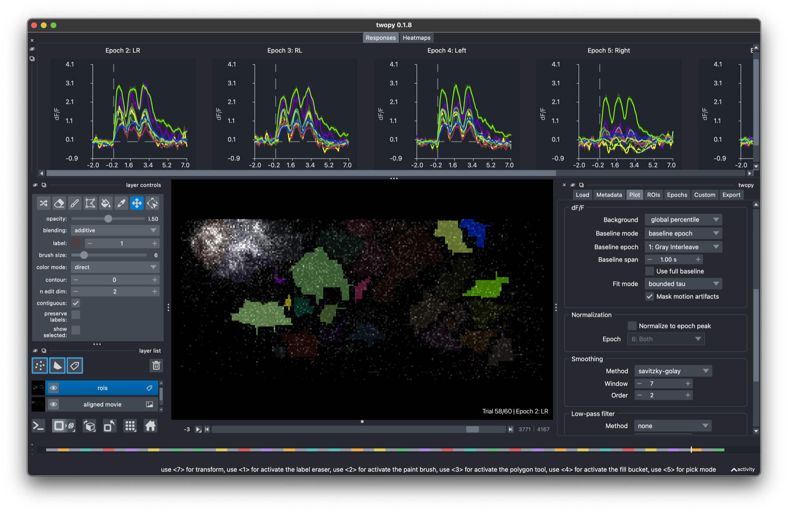

# twopy

twopy is a two-photon imaging analysis tool for Clark Lab recordings. Open a recording, draw ROIs, watch responses update live, and save the results.



## Pick your path

**I want to click through recordings in the app.** Start with [Getting started](getting_started.md), then the [GUI guide](gui/index.md).

**I want to script analyses in Python.** Start with [Getting started](getting_started.md), then the [Python guide](python_api.md).

**I want to add my own analysis to the app.** Read [Writing custom workflows](writing_custom_workflows.md).

## What twopy does

twopy converts raw microscope recordings into a clean, twopy-owned HDF5 format the first time you open them. Everything after that — ROI editing, response plots, custom analyses, saved outputs — works from those converted files. The original microscope files stay untouched.

By default, twopy keeps converted recordings in the local `~/.cache/twopy/recordings` cache. It copies converted HDF5 files and saved analysis outputs to `analysis_output`.

```{toctree}
:maxdepth: 2
:caption: Use twopy

getting_started
gui/index
python_api
```

```{toctree}
:maxdepth: 2
:caption: Extend twopy

writing_custom_workflows
```

```{toctree}
:maxdepth: 2
:caption: Reference

input_data_spec
recording_file_schema
development
```
